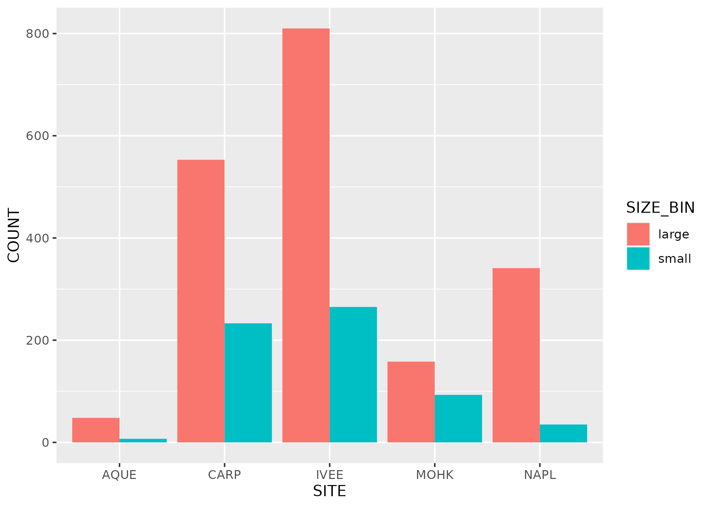
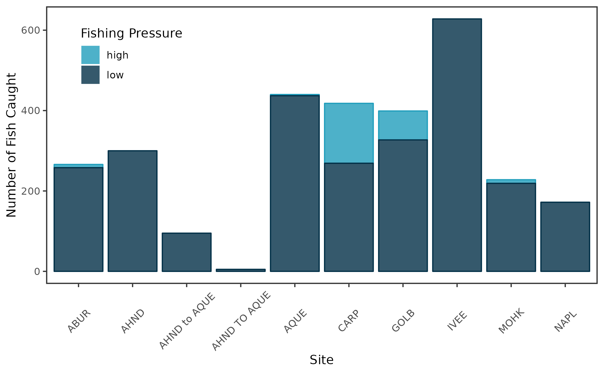

```{r setup, include=FALSE}
knitr::opts_chunk$set(echo = TRUE)
```

## Introduction Added 

Lobsters are being fished a lot! 

## Lobster size by region from 2019-2021

Lobsters are largest at sites CARP, IVEE, and NAPL. 




